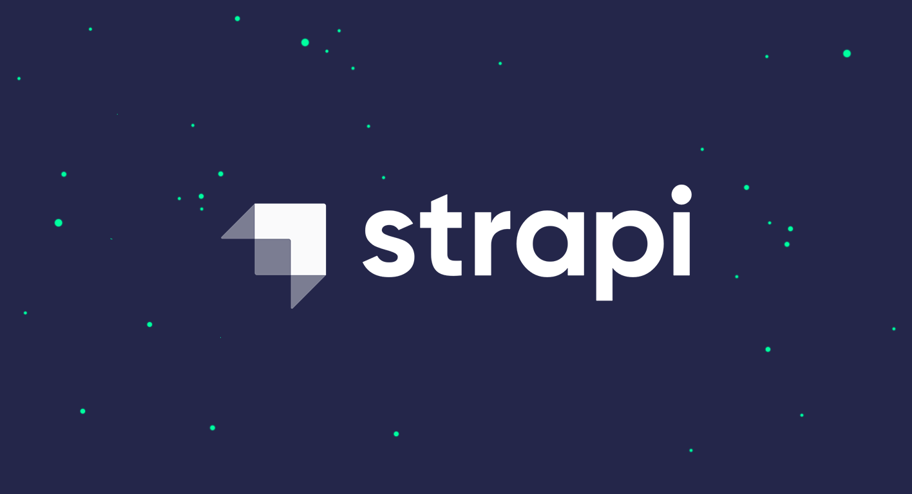
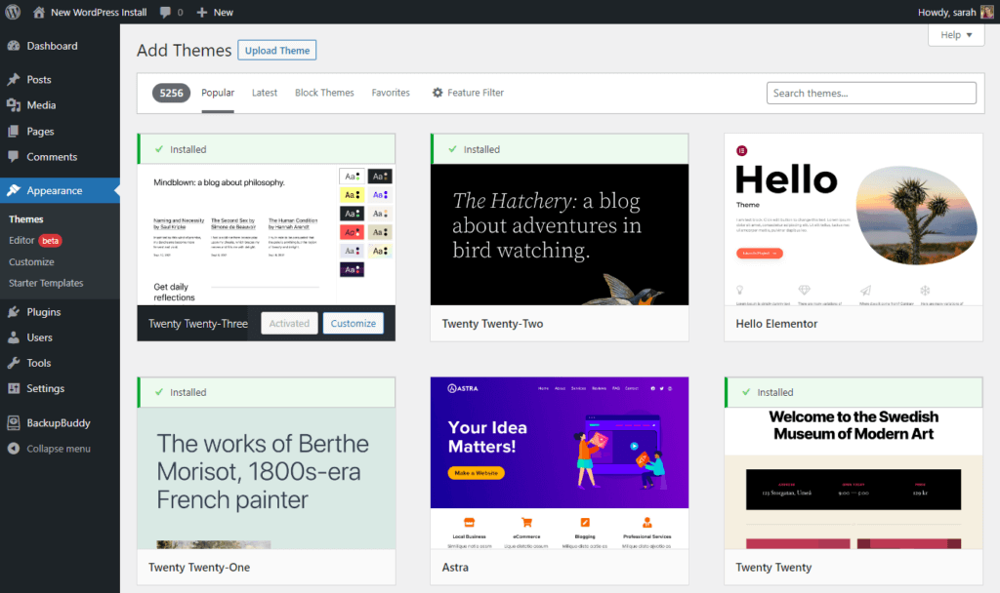
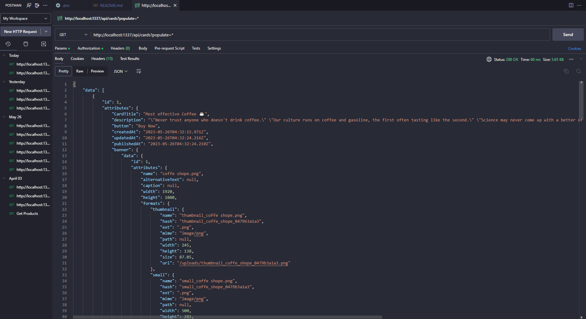

# Get Started With Strapi

## 𝙏𝙪𝙢𝙞 - 𝘼𝙢𝙞 ( সিরিজ - 01 ) 𝑾𝒉𝒂𝒕 𝒊𝒔 𝑺𝒕𝒓𝒂𝒑𝒊?

𝙏𝙪𝙢𝙞 - Strapi কি ?

𝘼𝙢𝙞 - Strapi হলো একটি Headless CMS.

𝙏𝙪𝙢𝙞 - Headless CMS মানে বুঝলাম না?

𝘼𝙢𝙞 - আচ্ছা আগে তোমাকে আমি CMS সম্পর্কে বোঝায় নিই, তারপরে Headless সম্পর্কে বুঝাবো | CMS হল একটি Content Management System বা কন্টেন্ট ম্যানেজমেন্ট সিস্টেম | Content মানে হল “বিষয়বস্তু” অর্থাৎ এখানে বলা যায় একটা ওয়েবসাইটের সমস্ত বিষয়বস্তু যেমন image, video, Text, button and etc হল Content | আর আমরা CMS ব্যবহার করে ওয়েবসাইটের সমস্ত কনটেন্ট ম্যানেজ করতে পারি | অর্থাৎ Create, Read, Update and Delete করতে পারি | আমরা এগুলো Strapi ব্যবহার করে খুব সহজে করতে পারি | তাই Strapi হল একটি কন্টেন্ট ম্যানেজমেন্ট সিস্টেম | বুঝতে পেরেছ ?

𝙏𝙪𝙢𝙞 - হ্যাঁ বুঝতে পেরেছি আলহামদুলিল্লাহ |

𝘼𝙢𝙞 - আচ্ছা তাহলে এবার আসি Headless কি এই বিষয়টাতে | Wordpress হলো একটি খুবই জনপ্রিয় CMS যেটা আমরা সবাই জানি | কিন্তু ওয়ার্ডপ্রেস কিন্তু Strapi এর মত Headless CMS না | তুমি কি জানো এটার কারণ কি?

𝙏𝙪𝙢𝙞 - না! আপনি বলে দেন |

𝘼𝙢𝙞 - কারণ হলো, কেউ যখন Wordpress দিয়ে কনটেন্ট ম্যানেজ করে তখন সেটা ওয়েবসাইটের Backend ডাটা তৈরি করার পাশাপাশি Frontend ও তৈরি করে দিবে | অথচ Headless Strapi তোমাকে শুধুমাত্র json ফরমেটে ডাটা দিয়ে দিবে তোমাকে নিজে নিজে Frontend বানিয়ে নিতে হবে|এখানে তুমি বলতে পারো Strapi এর মাথা নেই অর্থাৎ Headless. Frontend কে এখানে মাথার সাথে তুলনা করা হয়েছে |

## Wordpress

## Strapi

𝙏𝙪𝙢𝙞 - হুমমমম

𝘼𝙢𝙞 - এবার কি তাহলে ক্লিয়ার হয়েছো Headless CMS কি?

𝙏𝙪𝙢𝙞 - হ্যাঁ ভাইয়া ধন্যবাদ|এরপরে বলুন তাহলে |

𝘼𝙢𝙞 - না আজ এ পর্যন্ত, অন্যদিন আবার এ বিষয়ে কথা হবে | টাটা বাই বাই |

𝙏𝙪𝙢𝙞 - ওকে ভাইয়া ঠিক আছে |
